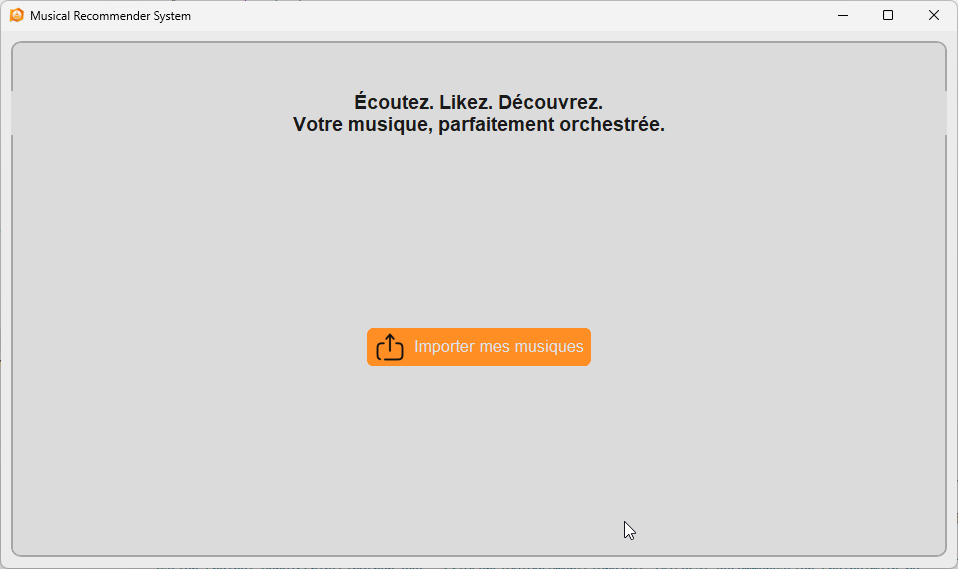
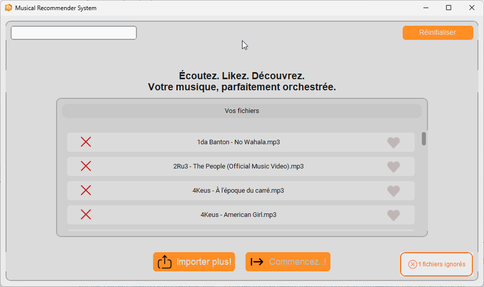
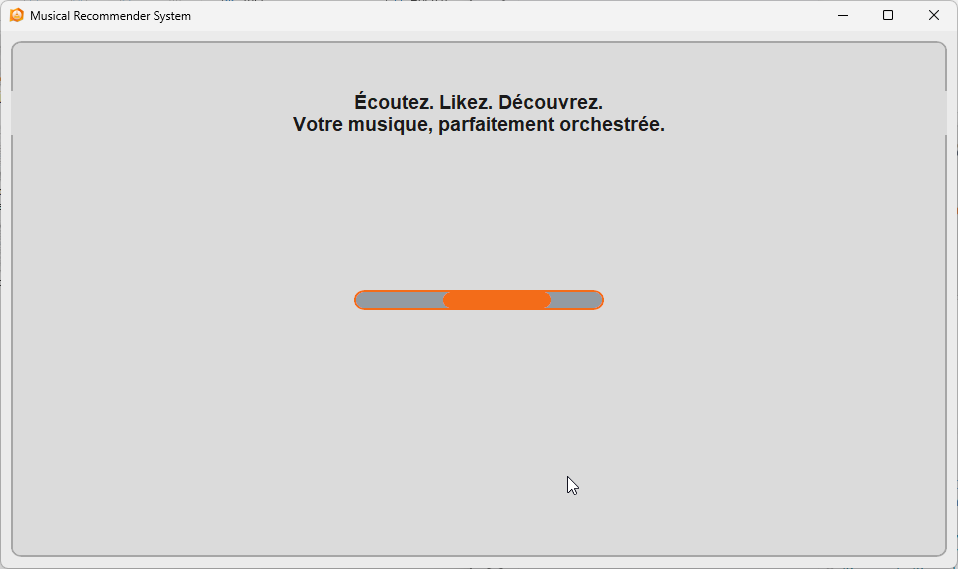
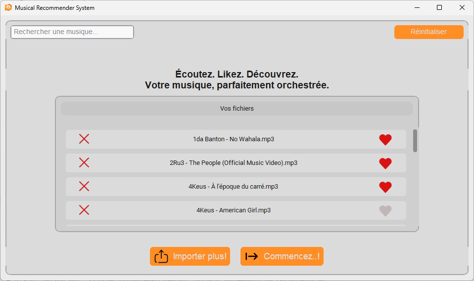
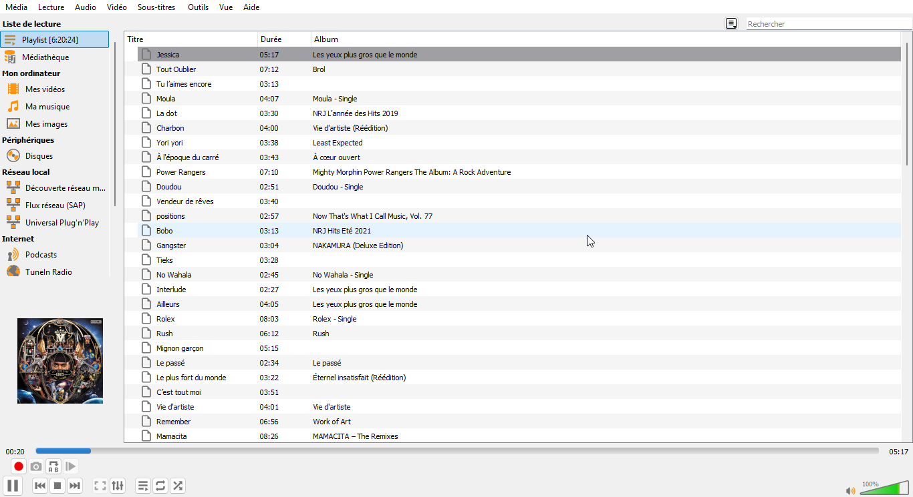

# 🎵 Musical Recommender System — Version 2

  
  
  
  
  


> **Système intelligent de recommandation musicale local basé sur l'analyse audio par IA, les embeddings vectoriels et un moteur de classement MMR.**

---

# 📋 Table des matières

- [Aperçu](#-aperçu)
- [Fonctionnement](#️⃣-fonctionnement)
- [Architecture](#️⃣-architecture)
- [Pipeline ML](#-pipeline-ml)
- [Téléchargement rapide — Windows](#-téléchargement-rapide--windows-sans-installation)
- [Installation](#-installation)
- [Utilisation](#️⃣-utilisation)
- [Base de données](#️⃣-base-de-données)
- [Algorithme MMR](#-algorithme-mmr)
- [Interface utilisateur](#️⃣-interface-utilisateur)
- [Différences avec la v1](#-différences-avec-la-v1)
- [Développement](#-développement)
- [Demo](#-demo)
- [Crédits](#-crédits)
- [Licence](#-licence)

---

# 🎯 Aperçu

Musical Recommender System v2 est une application desktop moderne permettant de générer automatiquement des playlists personnalisées à partir de vos fichiers audio locaux.

Le système fonctionne entièrement **hors-ligne** et apprend les préférences musicales de l'utilisateur à partir de morceaux likés.

## Fonctionnalités principales

- Interface graphique moderne avec **CustomTkinter**
- Analyse audio via **Musicnn / ONNX Runtime**
- Base de données vectorielle locale avec **LanceDB**
- Cache intelligent des embeddings avec **BLAKE3**
- Classement intelligent avec **MMR**
- Génération automatique de playlist `.m3u8`
- Lancement direct dans **VLC**
- Support des thèmes clair / sombre
- Import multi-fichiers audio

---

# ⚙️ Fonctionnement

## Workflow global

```text
1. Importation des fichiers audio
        ↓
2. Sélection des morceaux favoris
        ↓
3. Analyse audio par IA
        ↓
4. Construction du profil utilisateur
        ↓
5. Classement intelligent MMR
        ↓
6. Génération de playlist
        ↓
7. Lecture automatique via VLC
```

---

# 🏗️ Architecture

```text
musical-recommender-v2/
│
├── main.py
├── app.py
├── func.py
├── extraction.py
├── schema.py
│
├── msd-musicnn-1.onnx
├── requirements.txt
│
├── assets/
│   ├── light_upload.png
│   ├── dark_upload.png
│   ├── coeur_gris.png
│   ├── coeur_rouge.png
│   ├── loader.png
│   └── banner.png
│
└── MusicRecommenderDB/
    └── audio_embeddings.lance
```

---

# 🧠 Pipeline ML

```text
Audio File
    ↓
FFmpeg decoding
    ↓
PCM float32 16kHz mono
    ↓
Segmentation 10 secondes
    ↓
Sélection des segments représentatifs
    ↓
Musicnn (ONNX Runtime)
    ↓
Embeddings audio
    ↓
Mean Pooling + L2 Normalization
    ↓
Vecteur 200 dimensions
    ↓
LanceDB
    ↓
MMR Ranking
    ↓
Playlist finale
```

## Optimisations ONNX Runtime

```python
so.graph_optimization_level = ort.GraphOptimizationLevel.ORT_ENABLE_ALL
so.intra_op_num_threads = max(1, cpu // 2)
so.inter_op_num_threads = 1
```

---

# Téléchargement rapide — Windows (sans installation)

> **Vous n'êtes pas développeur et vous voulez juste essayer l'application ?**  
> Pas besoin d'installer Python, ni de compiler quoi que ce soit.

## Étapes

**1. Téléchargez le fichier ZIP**

👉 [**MusicRecommender.zip**](https://github.com/Flex1-tech/Local_Recommendation_Engine/releases/download/v2.0.0/MusicRecommender.zip)

**2. Extrayez le ZIP**

Faites un clic droit sur le fichier téléchargé → **Extraire tout...** → choisissez un dossier.

> ⚠️ Ne lancez pas l'application directement depuis le ZIP — extrayez d'abord.

**3. Installez VLC** *(si ce n'est pas déjà fait)*

VLC est nécessaire pour lire la playlist générée.  
👉 https://www.videolan.org/vlc/

**4. Lancez l'application**

Ouvrez le dossier extrait et double-cliquez sur **`MusicRecommender.exe`**.

---

> 💡 **Note Windows** : Si Windows affiche un avertissement de sécurité ("Windows a protégé votre ordinateur"), cliquez sur **Informations complémentaires** puis **Exécuter quand même**. Cela est normal pour les applications non signées.

---

# 🗄️ Base de données

Les embeddings audio sont stockés localement dans **LanceDB**.

Chaque morceau possède un identifiant unique basé sur un hash **BLAKE3** du contenu du fichier.

Ainsi :

- un embedding n'est calculé qu'une seule fois ;
- déplacer ou renommer un fichier ne force pas un recalcul ;
- les chemins sont mis à jour automatiquement.

```python
class TrackEmbeddingModel(LanceModel):
    file_name: str
    file_path: str
    file_hash: str
    file_size_bytes: int
    vector: Vector(200)
```

---

# 🎲 Algorithme MMR

Le système utilise **Maximal Marginal Relevance (MMR)** afin d'équilibrer :

- la pertinence musicale ;
- la diversité des recommandations.

## Formule

```text
MMR_score =
λ × sim(profil, candidat)
−
(1 − λ) × max_sim(candidat, sélectionnés)
```

| λ   | Résultat                       |
| --- | ------------------------------ |
| 1.0 | Pertinence maximale            |
| 0.7 | Équilibre pertinence/diversité |
| 0.0 | Diversité maximale             |

---

# 🚀 Installation

> **Vous êtes développeur et souhaitez modifier ou contribuer au projet ?**  
> Suivez les étapes ci-dessous. Sinon, consultez la section [Téléchargement rapide](#-téléchargement-rapide--windows-sans-installation) ci-dessus.

## Prérequis

- Python 3.10+
- FFmpeg
- VLC Media Player

## Clonage

```bash
git clone https://github.com/Flex1-tech/Local_Recommendation_Engine.git
cd musical-recommender-v2
```

## Environnement virtuel

### Windows

```bash
python -m venv .venv
.venv\Scripts\activate
```

### Linux / macOS

```bash
python -m venv .venv
source .venv/bin/activate
```

## Installation des dépendances

```bash
pip install -r requirements.txt
```

## Vérification

```bash
ffmpeg -version
vlc --version
```

---

# ▶️ Utilisation

```bash
python main.py
```

## Étapes

| Étape    | Description                      |
| -------- | -------------------------------- |
| Import   | Ajouter des fichiers audio       |
| Likes    | Sélectionner au moins 3 morceaux |
| Analyse  | Lancer le moteur IA              |
| Playlist | Génération automatique           |
| Lecture  | Ouverture automatique VLC        |

---

# 🎬 Demo

## Écran d'accueil

<p align="center">
  
</p>

---

## Upload des fichiers

<p align="center">
  
</p>

---

## Chargement

<p align="center">
  
</p>

---

## Like / Delete des morceaux

<p align="center">
  
</p>

---

## Chargement IA

<p align="center">
  
</p>

---

## Playlist finale dans VLC

<p align="center">
  
</p>

---

# 🖥️ Interface utilisateur

## Caractéristiques UI

- Interface responsive avec `grid`
- Thread dédié pour l'inférence
- UI non bloquante
- Loader animé
- Barre de recherche dynamique
- Gestion thème clair/sombre
- Toasts et feedback utilisateur

## Palette

| Élément          | Couleur   |
| ---------------- | --------- |
| Accent principal | `#FF8E25` |
| Hover            | `#F36C19` |

---

# 🔄 Différences avec la v1

| Fonctionnalité        | v1      | v2      |
| --------------------- | ------- | ------- |
| Interface moderne     | ❌       | ✅       |
| Recherche dynamique   | ❌       | ✅       |
| Threading UI          | ❌       | ✅       |
| LanceDB               | ❌       | ✅       |
| Cache embeddings      | ❌       | ✅       |
| MMR Ranking           | ❌       | ✅       |
| Playlist intelligente | Basique | Avancée |

---

# 🔧 Développement

## Vérifier le modèle

```bash
python -c "from extraction import load_musicnn; s = load_musicnn(); print('Musicnn OK')"
```

## Vérifier la base

```bash
python -c "from extraction import initialize_database; t = initialize_database('.'); print(t.count_rows(), 'entrées')"
```

## Tester un embedding

```bash
python -c "
from extraction import compute_embedding, load_musicnn
s = load_musicnn()
v = compute_embedding('test.mp3', s)
print(v.shape if v is not None else 'None')
"
```

---

# 🙏 Crédits

- **Musicnn / Essentia**
  - [Index of /models/feature-extractors/musicnn/](https://essentia.upf.edu/models/feature-extractors/musicnn/)

- **CustomTkinter**
  - [GitHub - TomSchimansky/CustomTkinter](https://github.com/TomSchimansky/CustomTkinter)

- **LanceDB**
  - [https://lancedb.com/](https://lancedb.com/)

- **BLAKE3**
  - [GitHub - BLAKE3-team/BLAKE3](https://github.com/BLAKE3-team/BLAKE3)

---

## Custom Non-Commercial License (CNC-L)

##### Version 1.0 — © 2026 Flex1-tech. Tous droits réservés.

Le présent accord de licence (la « Licence ») régit l'utilisation, la copie et la distribution du projet et de l'ensemble de ses fichiers associés (le « Logiciel ») développés par Flex1-tech (l' « Auteur »).

En téléchargeant, installant ou utilisant le Logiciel, vous acceptez d'être lié par les termes de cette Licence.

1. **Usages Autorisés (Gratuits)**

L'Auteur concède par la présente une licence mondiale, non exclusive et non transférable, permettant d'utiliser le Logiciel à titre gratuit exclusivement pour les finalités suivantes :

- **Usage Personnel** : Utilisation privée par un individu à des fins strictement non lucratives.
- **Usage Éducatif et Recherche** : Utilisation au sein d'établissements scolaires, universitaires ou de laboratoires de recherche publique.
- **Expérimentation** : Tests, évaluation technique et contributions non commerciales au code source.

2. **Restrictions et Usages Commerciaux Interdits**

Tout usage non expressément autorisé à l'Article 1 est formellement interdit sans l'obtention préalable d'une Licence Commerciale écrite et signée par l'Auteur. Sont notamment qualifiés d'usages commerciaux :

- **Intégration** : L'inclusion du Logiciel, en tout ou partie, dans un produit, service ou infrastructure d'une entité commerciale.
- **Monétisation** : L'utilisation du Logiciel pour générer des revenus, directs ou indirects (abonnements, services payants, support technique facturé, affichage publicitaire).
- **Redistribution** : La redistribution, la revente ou la sous-licence du Logiciel à des fins commerciales.

3. **Processus de Commercialisation et Partage de Revenus**

Si vous souhaitez exploiter le Logiciel à des fins commerciales, vous devez impérativement régulariser votre situation :

- **Demande Obligatoire** : Contactez l'Auteur avant toute mise en exploitation.
- **Accord au Cas par Cas** : Les modalités d'octroi de la licence commerciale feront l'objet d'un contrat d'exploitation distinct.
- **Compensation et Royalties** : L'accord commercial exigera une compensation financière, sous forme de redevances fixes ou d'un partage de revenus (royalties) proportionnel aux gains générés par l'exploitation du Logiciel.

4. **Violation et Résiliation**

Toute utilisation du Logiciel en violation de la présente Licence entraînera la résiliation automatique et immédiate de vos droits d'usage. L'Auteur se réserve le droit d'engager des poursuites judiciaires pour contrefaçon et de réclamer des dommages-intérêts équivalents au préjudice financier subi.

**Contact pour les Licences Professionnelles**

Pour toute demande de partenariat, de licence commerciale ou de devis :  
📩 **[Mail](mailto:sethakplogan@gmail.com)**

---

> *"Écoutez. Likez. Découvrez. Votre musique, parfaitement orchestrée."*
